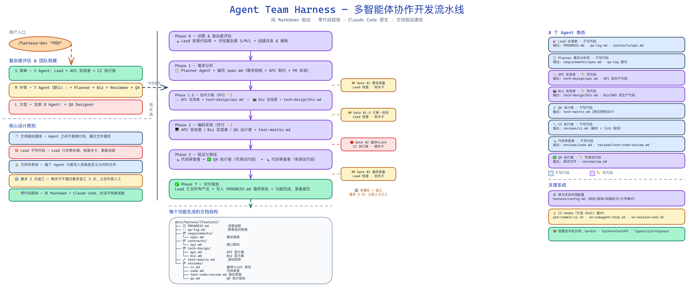

# DiegoC-Harness

> **纯提示词驱动的多 Agent 协作开发流水线**，Claude Code 插件。
> 8 个 Agent 角色，7 个步骤，4 道质量关卡。**不挑技术栈**。

## ✨ 亮点

| 亮点 | 说明 |
|------|------|
| 🧠 **100% 提示词驱动** | 没有一行脚本逻辑——所有 Agent 行为、流水线编排、质量关卡全部由提示词定义。改行为就是改 Markdown，不需要写代码。 |
| 🤖 **8 个专职 Agent** | Lead、Planner、API Implementer、Biz Implementer、QA Designer、CI Runner、Code Reviewer、QA Runner——各司其职，边界清晰。Agent 之间不直接对话，通过 Lead + qa-log.md 协调。 |
| 🛡️ **4 道质量关卡** | 需求质量 → 方案一致性 → 编译+Lint → 审查+测试。每关最多 2 次返工，2 次后自动升级给人类。关卡 #2（编译+Lint）可硬化为 pre-commit hook。 |
| 🌐 **不挑技术栈** | Agent 定义和流水线中不硬编码任何语言或工具。Go/Python/Node.js/Java/Rust/... 所有差异集中在 `harness/config.md`（30 行配置）。 |
| 🔄 **中断恢复** | 会话断了？重敲 `/harness-dev`，Lead 从 `PROGRESS.md` 中断点自动恢复，已完成的步骤不会重新执行。 |
| 📦 **项目零污染** | 命令、Agent 定义、模板、关卡清单全在 `~/.claude/` 下。你的项目只多 `harness/config.md` + `docs/harness/` 产出目录。 |
| ⚡ **并行执行** | 技术方案阶段 API/Biz 设计并行、编码阶段 3 个 Agent 并行——不是串行等，是真正的并行 spawn。 |
| 🔌 **原生 Claude Code 插件** | 不需要额外工具、不需要 API key、不需要配置 MCP server。安装就是 `git clone` + `cp` 两条命令。 |

---

## 安装

### 方式 A：一键脚本

```bash
curl -fsSL https://raw.githubusercontent.com/iluv7/DiegoC-Harness/main/install.sh | bash
```

脚本干两件事：
1. 克隆仓库到 `~/.claude/plugins/local/DiegoC-Harness/`（存放支持文件）
2. 把命令文件拷到 `~/.claude/commands/`（Claude Code 自动发现）

### 方式 B：手动

```bash
# 1. 克隆
git clone https://github.com/iluv7/DiegoC-Harness.git ~/.claude/plugins/local/DiegoC-Harness

# 2. 注册命令（Claude Code 只自动发现 ~/.claude/commands/）
mkdir -p ~/.claude/commands
cp ~/.claude/plugins/local/DiegoC-Harness/commands/*.md ~/.claude/commands/
```

**重启 Claude Code** 后 `/harness-init` 和 `/harness-dev` 全局可用。

---

## 使用

### 1. 项目初始化（一次）

在任意项目目录下，进入 Claude Code 敲：

```
/harness-init
```

引导你创建 `harness/config.md`（语言、框架、编译命令、文件路径）。

### 2. 开发功能

```
/harness-dev "你的 PRD 或功能描述"
```

Lead 按 7 步 4 关卡自动拉起子 Agent：需求分析 → 技术方案 → 编码 → CI → 审查 → 测试 → 交付。

### 3. 中断恢复

会话断了？重新敲 `/harness-dev`，从 `PROGRESS.md` 中断点恢复。

---

## 📸 完整使用过程

下面以 **"开发一个 ABTest SDK"** 为例，展示一次完整的 `/harness-init` + `/harness-dev` 跑通全过程。

> 项目技术栈：Go + Gin（DAO 层用 memory 实现，不依赖外部 DB）。全程无需人类插手，Lead 自动协调 8 个 Agent 完成交付，总耗时 14:58 → 15:22 共 24 分钟。

### 第 0 步：项目初始化（一次性）

在空项目目录下，进入 Claude Code 敲：

```
/harness-init
```

Lead 加载 Skill 后开始问项目配置（项目名、语言、框架、目录约定等）。

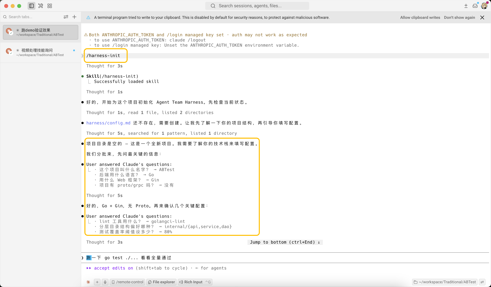

回答几个关键配置后，Lead 输出完整的配置摘要——项目名 `ABTest`、Go + Gin、DAO 用 memory 模式、分层目录约定等。

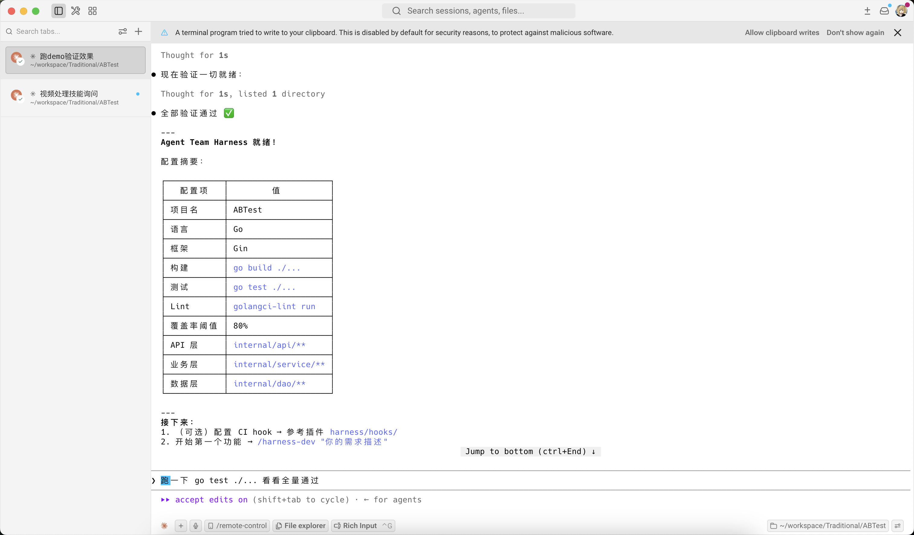

---

### 第 1 步：发起开发

在 Claude Code 中输入：

```
/harness-dev "做一个专门用来做AB实验的sdk或工具类，要求插上即用，要可以精确控制对照组和实验组，比如1%~99%，10%~90%这种灰度控制"
```

Lead 启动。

---

### 第 2 步：项目侦察 & 复杂度评估

Lead 读取 `harness/config.md`、扫描项目代码结构、评估功能复杂度（**S/M/L**）——本例评估为 **M 级（6 人团队）**——并创建 `docs/harness/abtest-sdk/` 目录、初始化 `PROGRESS.md`。

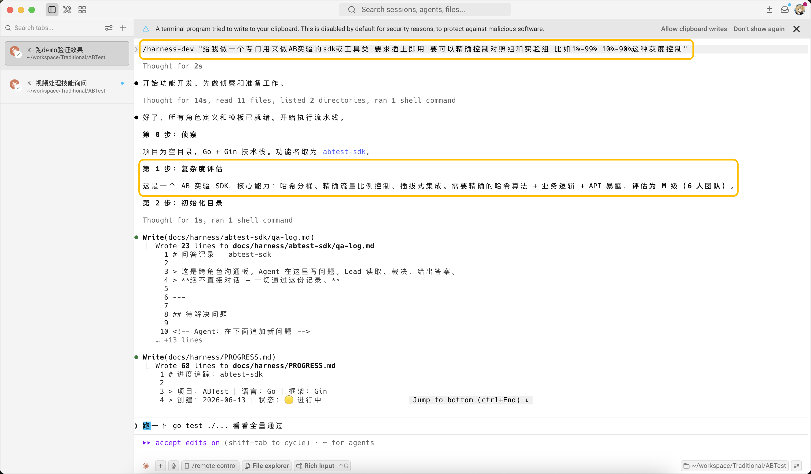

---

### 阶段 1：需求分析（Planner）

Lead spawn Planner Agent。Planner 读取 PRD，产出结构化需求规格：

- 功能需求（FR-1, FR-2, ...）按 P0/P1/P2 分级
- 每个接口精确的 API 契约（方法、路径、请求/响应类型、错误码）
- 文件影响清单

Planner 在 `qa-log.md` 里抛出 6 个待解决问题，Lead 基于跨领域观察给出裁决（首次发版范围明确：memory 模式 + 非粘性分配 + 允许实验重置 + 不做统计检验，构成最小可用 SDK，真正"插上即用"）。

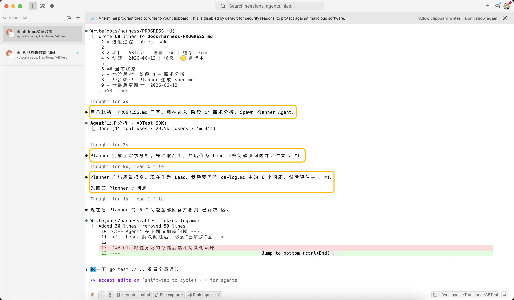

**关卡 #1**：Lead 验证需求完整性——覆盖是否全面、验收标准是否可衡量、API 契约类型是否精确、有无未回答的问题。**6/6 全部通过。**

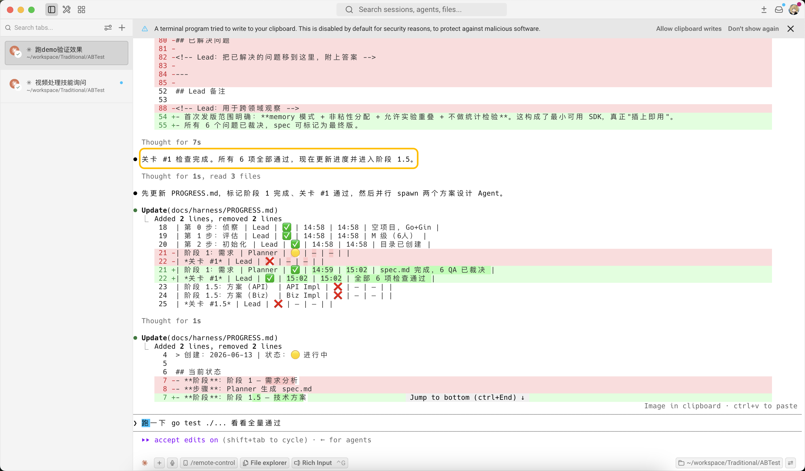

---

### 阶段 1.5：技术方案（API + Biz 并行）

Lead **并行 spawn** 两个 Agent：

- **API Implementer** → 设计 `tech-design/api.md`（路由、handler、请求校验）
- **Biz Implementer** → 设计 `tech-design/biz.md`（service 层、数据访问）

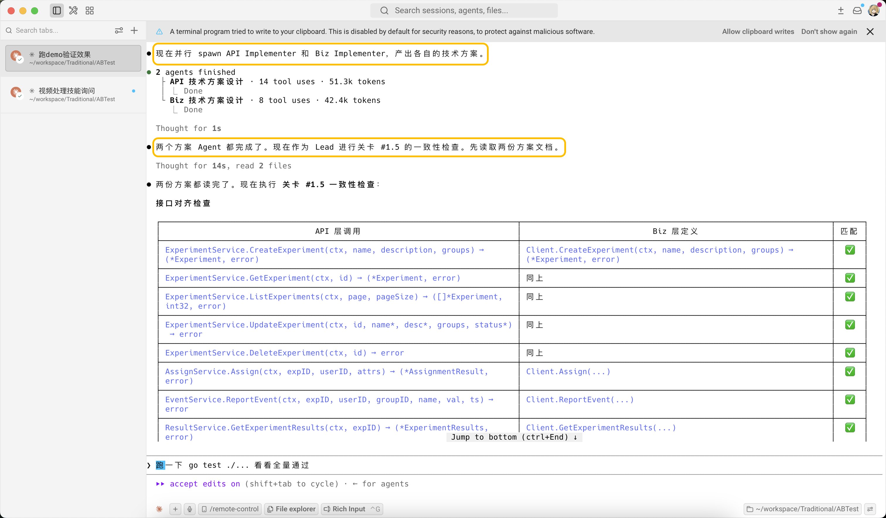

**关卡 #1.5**：Lead 验证两边的接口一致性——API 调用的方法 Biz 是否定义了、参数/返回类型是否对齐、有无文件冲突、路由 & Service 是否全覆盖。**8/8 接口签名精确匹配，零文件冲突，8 个 HTTP 端点 + 8 个业务操作全覆盖。直接通过。**

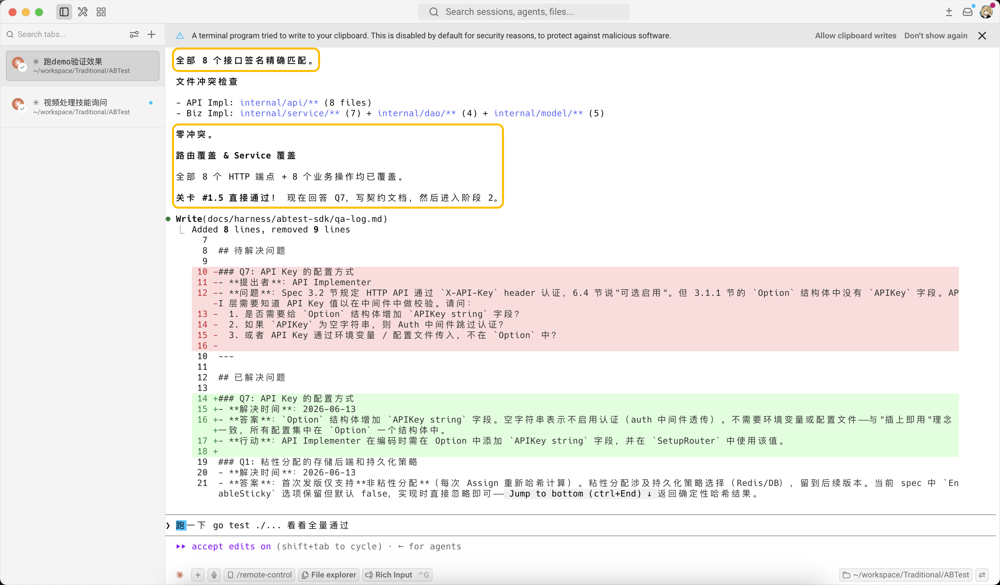

Lead 汇总成统一契约文档 `contracts/api.md`，进入阶段 2。

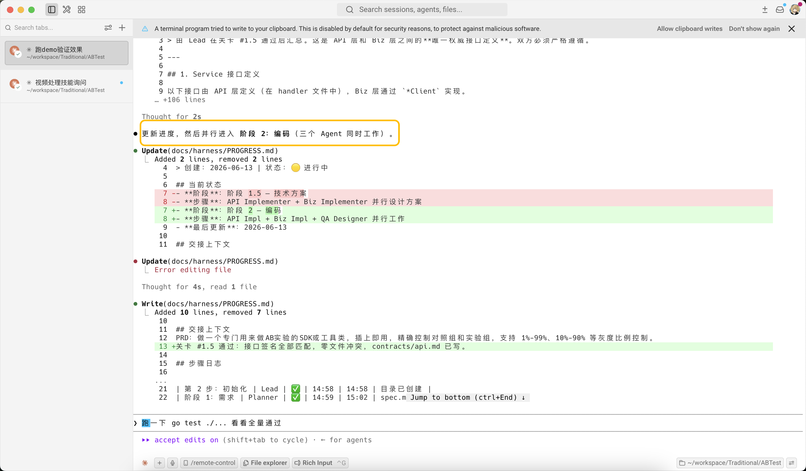

---

### 阶段 2：编码（3 Agent 并行）

Lead **并行 spawn** 三个 Agent：

- **API Implementer** → 写 API handler / 路由代码（8 个 API 文件）
- **Biz Implementer** → 写 service 层 + DAO 层代码（model/dao/service + go.mod，编译通过）
- **QA Designer** → 设计测试矩阵（111 条用例，38.7% 负向）

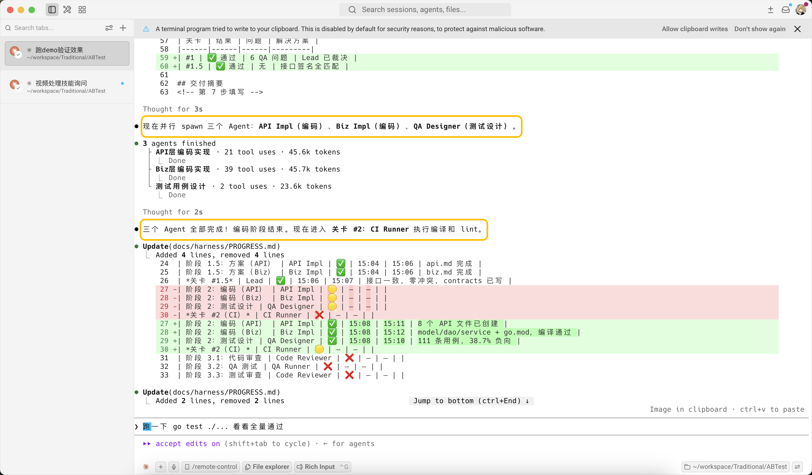

**关卡 #2**：Lead spawn CI Runner 跑编译 + lint。

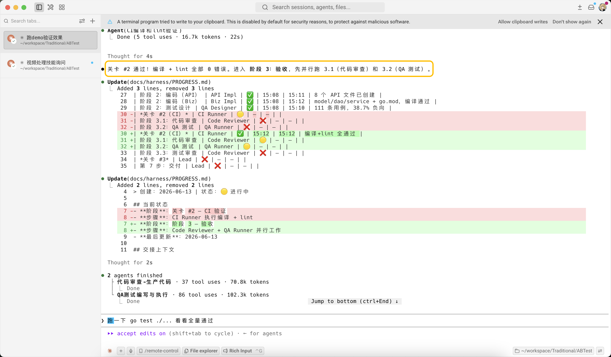

**编译 + lint 全部 0 错误。** 进入阶段 3。

---

### 阶段 3：验收（3 轮审查）

**3.1 代码审查**：Lead spawn Code Reviewer，对全部改动做静态审查。命中 **1C + 4I + 5M**——C-1（严重）必须修，I-1/I-2/I-4（重要）应在此轮修。

**3.2 测试执行**：Lead spawn QA Runner，按测试矩阵写测试代码并运行，**72/72 PASS，coverage 33.6%**。

**3.3 测试代码审查**：Lead spawn Code Reviewer（测试模式），审查测试代码质量（3C + 10I + 5M，3C 均为非阻塞）。

**修复回路**：3.1 + 3.2 完成后，Lead 判断阻塞性问题需先修才能过 Gate #3，**并行 spawn 两个修复 Agent**：
- 修复 Biz 层 C-1/I-1/I-4
- 修复 API 层 I-1/I-2

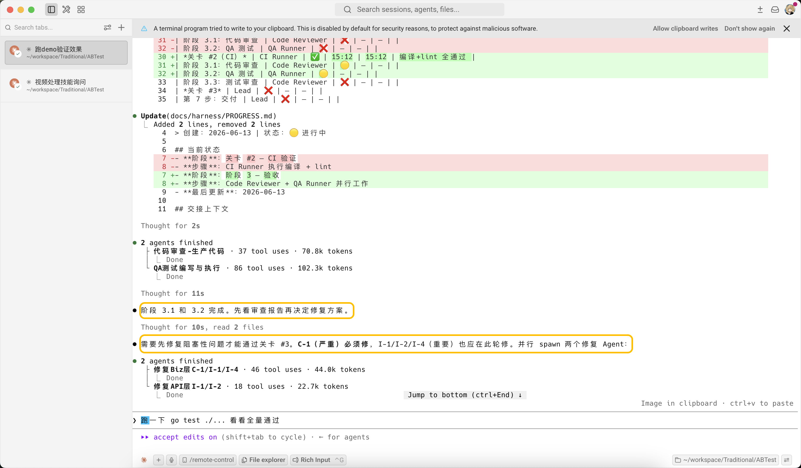

**关卡 #3**：Lead 做最终验收——对 3 个"严重"问题做实质评估（SEV-01 空 experimentID 已报非法值校验、SEV-02 已有端到端覆盖、SEV-03 修复后已无问题），**0 个真正严重问题，72/72 测试全绿**。

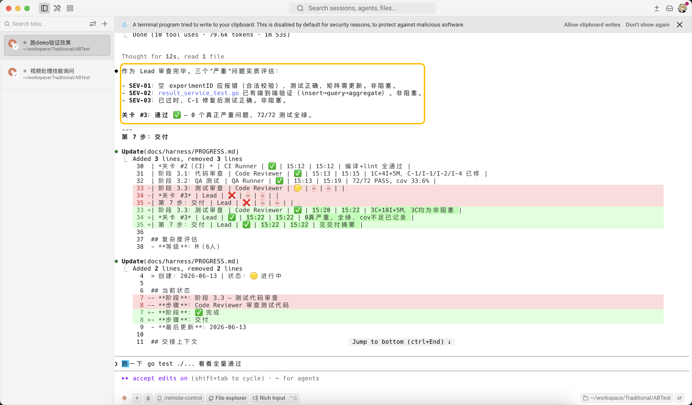

---

### 交付

全部关卡通过后，Lead 汇总所有产出，输出交付摘要：

| 层 | 文件数 | 说明 |
|----|--------|------|
| Model | 5 | Experiment, Group, Event, Result, Assignment + 错误定义 |
| DAO | 4+1 | Experiment/Event/Assignment/Result DAO（interface + memory 实现）+ 测试 |
| Service | 7+5 | Client, 4 个 Service, Hasher, Filter + 5 个测试文件 |
| API | 7+1 | 5 个 Handler, Router, Response, 2 个中间件 |
| 入口 | 1 | cmd/server/main.go |
| 文档 | 10 | spec, 2 tech-design, contracts, test-matrix, 4 reviews |

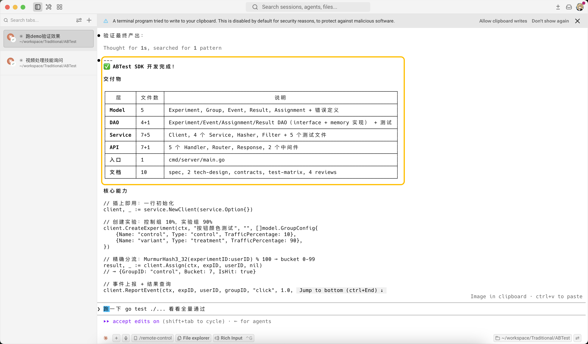

最终项目结构：

```
你的项目/
├── harness/config.md                      ← 技术栈配置
└── docs/harness/abtest-sdk/
    ├── PROGRESS.md                        ← 进度追踪（✅ 全部完成）
    ├── qa-log.md                          ← Agent 问答记录
    ├── contracts/api.md                   ← 接口契约（Lead 裁决）
    ├── requirements/spec.md               ← Planner 需求规格
    ├── tech-design/
    │   ├── api.md                         ← API 技术方案
    │   └── biz.md                         ← 业务层技术方案
    └── reviews/
        ├── code.md                        ← Code Reviewer 报告
        ├── qa.md                          ← QA Runner 测试报告
        └── test-code-review.md            ← 测试代码审查报告
```

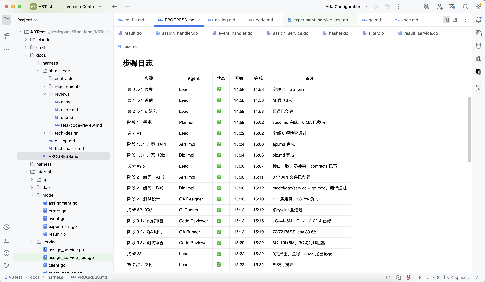

> 💡 **本次运行实际耗时 24 分钟**（14:58 → 15:22），人类只需在发起时写一句 PRD，以及关卡失败升级时做决策。中间 4 道关卡全部一次通过，未触发返工。

---

## 项目里会多什么

```
你的项目/
├── harness/config.md          ← 技术栈配置（填一次，30 行）
└── docs/harness/{功能名}/     ← 功能开发产出
```

命令、Agent 定义、模板全在 `~/.claude/` 下，项目零污染。

---

## 8 个 Agent 角色

| 角色 | 做什么 | 写代码？ |
|------|--------|:---:|
| **Lead** | 总协调，不写代码，验关卡 | ✗ |
| **Planner** | 读 PRD → 结构化需求 + API 契约 | ✗ |
| **API Implementer** | API/handler/路由 + 请求校验 | ✓ |
| **Biz Implementer** | 业务逻辑 + 数据访问 | ✓ |
| **QA Designer** | 设计测试矩阵 | ✗ |
| **CI Runner** | 跑编译 + lint | ✗ |
| **Code Reviewer** | 静态审查 + 测试审查 | ✗ |
| **QA Runner** | 写测试 + 跑测试 + 出报告 | ✓ |

---

## 技术栈适配

所有差异集中在 `harness/config.md`。Agent 定义和流水线**不硬编码任何语言或工具**。`examples/` 下有 Go/Python/Node.js 预配。

---

## 可选：CI Hook

项目 `.claude/settings.json`：

```json
{
  "hooks": {
    "PreToolUse": [{
      "matcher": "Bash(git commit*)",
      "command": "bash ~/.claude/plugins/local/DiegoC-Harness/harness/hooks/pre-commit-ci.sh"
    }]
  }
}
```

---

## 许可证

MIT
